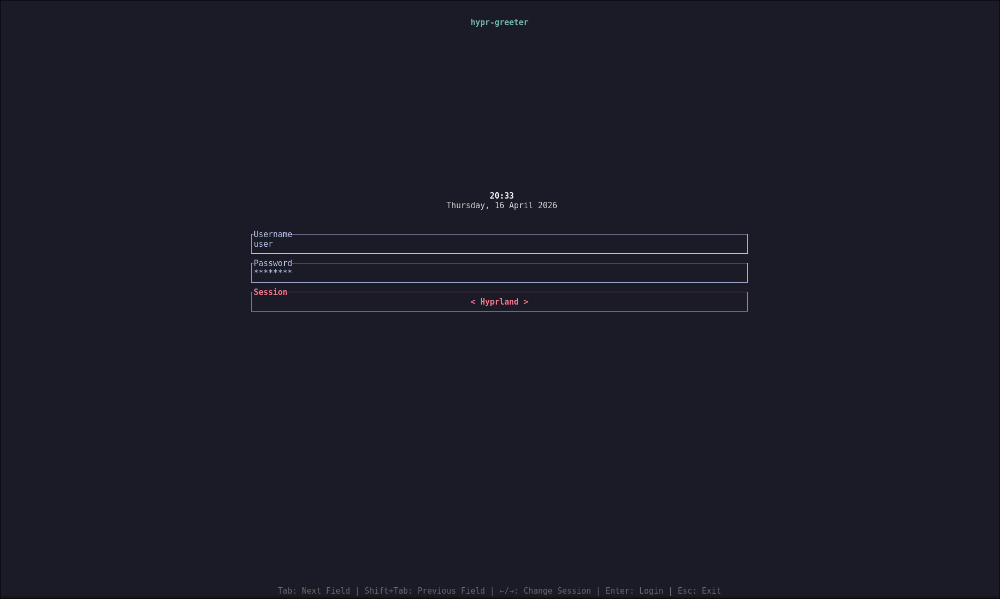

# Hypr-Greeter

A TUI greeter for Hyprland, built on [greetd](https://github.com/kennylevinsen/greetd).

> **Warning:** This project is experimental. Installation modifies system services, disables other display managers, and creates system users. A misconfiguration can leave you without a working login manager. Use at your own risk and make sure you know how to recover from a TTY.

---

## Features

- Multi-monitor support — login form on one monitor, solid background on the rest
- Session selector (Hyprland, Sway, TTY, or custom)
- Remembers last logged-in username
- Clock and date display
- Configurable keyboard layouts
- Secure password handling (masked input, clear on error)
- Simple TOML configuration

---

## Architecture

```
greetd → hypr-greeter-wrapper.sh → start-hyprland → Hyprland (generated config)
                                                          ├─ foot -e hypr-greeter  (login monitor)
                                                          └─ solid background      (all other monitors)
```

The wrapper script reads your TOML config, generates a minimal Hyprland config at runtime, and launches Hyprland as the greeter compositor via `start-hyprland`. The TUI runs inside a foot terminal on the designated login monitor.

`[[sessions]]` controls the session started after authentication — it does not affect how the greeter itself is launched.

---

## Dependencies

- [greetd](https://github.com/kennylevinsen/greetd) — display manager daemon
- [Hyprland](https://github.com/hyprwm/Hyprland) — Wayland compositor
- [foot](https://codeberg.org/dnkl/foot) — terminal emulator
- [Rust](https://www.rust-lang.org/) — build dependency

---

## Installation

```bash
git clone https://github.com/obamosaurus/hypr-greeter
cd hypr-greeter
cp config.example.toml config.toml   # edit to taste
sudo bash install.sh
sudo systemctl start greetd
```

The install script will:
- Install missing dependencies via pacman (with AUR fallback via yay)
- Build the greeter with `cargo build --release`
- Install binaries to `/usr/local/bin/`
- Copy `config.toml` to `/etc/hypr-greeter/config.toml` (if not already present)
- Create the `greeter` and `greetd` system users
- Configure and enable `greetd.service`
- Disable any conflicting display managers (ly, gdm, sddm, lightdm, etc.)

---

## Configuration

The greeter looks for config in this order:
1. `/etc/hypr-greeter/config.toml` (system — installed by the install script)
2. `~/.config/hypr-greeter/config.toml` (user fallback)

See [config.example.toml](config.example.toml) for all available options with comments.

### Full example

```toml
default_user = ""
disable_autofill = false

# Monitor setup (optional — omit for auto-detect)
# Run `hyprctl monitors` from your session to find monitor names.
[[monitors]]
name = "DP-1"
resolution = "2560x1440@144"
position = "0x0"
login = true        # show login form on this monitor

[[monitors]]
name = "HDMI-A-1"
resolution = "1920x1080@60"
position = "2560x0"

# Sessions available in the selector
[[sessions]]
name = "Hyprland"
command = "start-hyprland"

[[sessions]]
name = "Sway"
command = "sway"

[[sessions]]
name = "TTY"
command = "/bin/bash"

# Keyboard layout passed to Hyprland
[input]
kb_layout = "us"
kb_variant = ""
kb_options = ""

[ui]
title = "hypr-greeter"
show_clock = true
clock_format = "%H:%M"
show_date = true
date_format = "%A, %d %B %Y"
field_width = 50        # percentage of terminal width
field_spacing = 0       # rows between fields
top_spacing = 15        # rows from top to clock
clock_spacing = 0       # rows from clock to fields

[ui.colors]
background = "#1a1b26"
foreground = "#c0caf5"
focused = "#f7768e"
error = "#f7768e"

[security]
clear_password_on_error = true
mask_password = true
```

### Monitors

Omit the `[[monitors]]` section entirely to let Hyprland auto-detect all connected displays. Only add monitor blocks if you need to set resolution, position, scale, or pin the login form to a specific output.

Set `login = true` on exactly one monitor to place the login form there. If omitted, the first listed monitor is used.

Run `hyprctl monitors` from your Hyprland session to find monitor names.

### Keyboard layouts

```toml
[input]
kb_layout = "us,de"
kb_variant = ",nodeadkeys"
kb_options = "grp:alt_shift_toggle"
```

These are standard XKB settings passed directly to Hyprland. Use comma-separated values for multiple layouts and `kb_options` to set a toggle key.

The wrapper also respects `XKB_DEFAULT_LAYOUT`, `XKB_DEFAULT_VARIANT`, and `XKB_DEFAULT_OPTIONS` environment variables as fallbacks, but the config file is the preferred way to set this.

---

## Screenshots



---

## Uninstallation

```bash
sudo bash uninstall.sh
```

The script will prompt before removing config files, greetd state, and the greeter user.

---

## Development

```bash
cargo build              # debug build
cargo build --release    # release build
bash -x hypr-greeter-wrapper.sh   # inspect generated Hyprland config
```

---

## License

MIT

---

## Acknowledgments

- [greetd](https://github.com/kennylevinsen/greetd)
- [Hyprland](https://github.com/hyprwm/Hyprland)
- [foot](https://codeberg.org/dnkl/foot)
- [ratatui](https://github.com/ratatui-org/ratatui)
